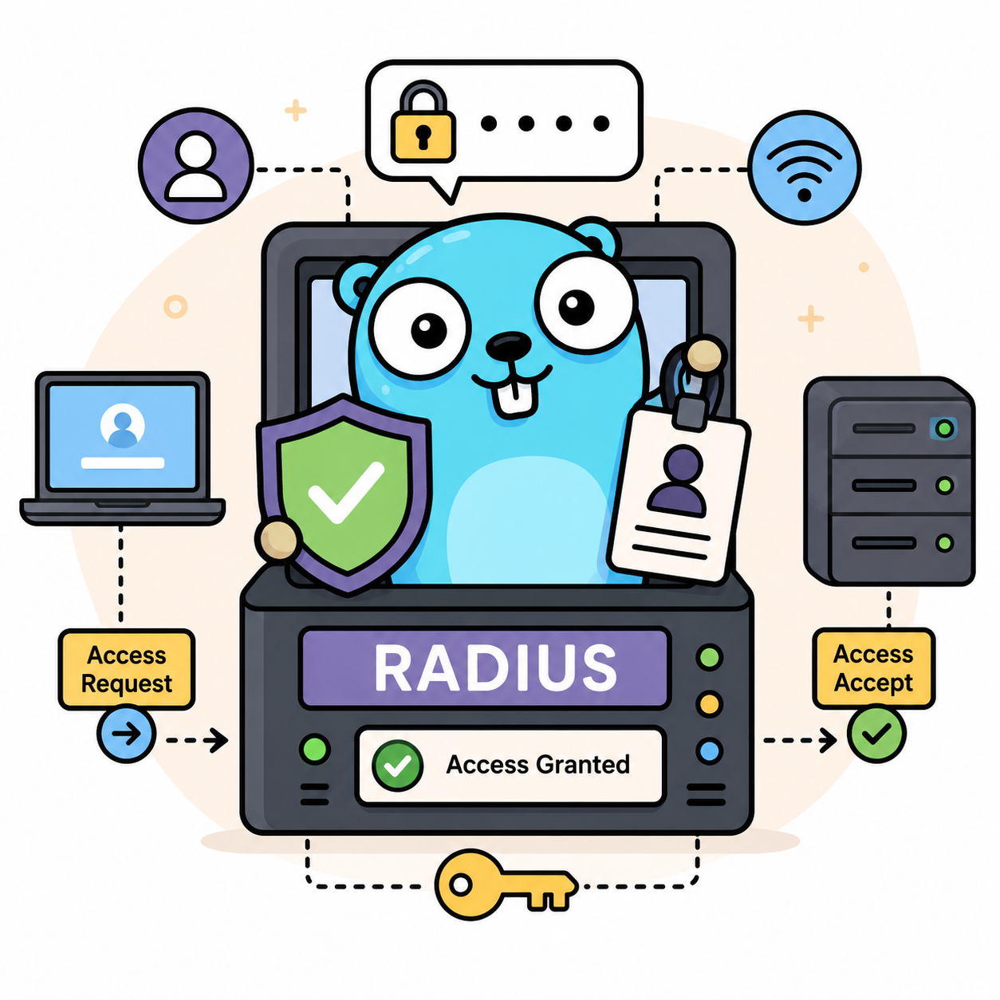

# radius-go



radius-go is a small RADIUS authentication server written in Go. It is designed for teams that need a simple access-authentication system before a full identity platform is available.

Typical uses include:

- Lab or small-office access authentication where a RADIUS PAP backend is accepted by the network device.
- Temporary VPN, Wi-Fi, or network-device authentication during an infrastructure migration.
- A tightly scoped internal authentication service for a small number of users and network access clients.

The server stores users and API keys in SQLite, hashes user passwords with bcrypt, hashes API keys with SHA-256, exposes a protected Gin API, and only accepts RADIUS packets from explicitly configured client CIDR ranges.

## Features

- RADIUS Access-Request handling for PAP `User-Name` and `User-Password`.
- Multiple configured RADIUS clients, each with its own CIDR range and shared secret.
- Unknown RADIUS clients are silently dropped.
- User management API for creating, suspending, deleting, and changing passwords.
- API key management API for creating, suspending, and deleting API keys.
- Paginated user and API key listing. User listing supports username search.
- Mandatory `X-API-Key` authentication for every `/api` request.
- Optional API source allowlist for exact IP addresses or CIDR ranges.
- Trusted reverse proxy support for `X-Forwarded-For` and `X-Real-IP`.
- SQLite database creation on first startup.
- One-time bootstrap API key printed when a new database is created.
- zap logging with lumberjack rotation. Daily rotation is enabled by default.
- YAML configuration.

## Requirements

- Go 1.25.10.
- SQLite support through `github.com/mattn/go-sqlite3`, which requires CGO.

## Build

```sh
go mod tidy
go test ./...
go build -o radius-go ./cmd/radius-go
```

## Docker

Build the image:

```sh
docker build -t radius-go:local .
```

Create and edit a config file before running:

```sh
cp config.example.yaml config.yaml
```

Run the container:

```sh
docker run --rm \
  --name radius-go \
  -p 8080:8080/tcp \
  -p 1812:1812/udp \
  -v "$PWD/config.yaml:/app/config.yaml:ro" \
  -v radius-go-data:/app/data \
  -v radius-go-logs:/app/logs \
  radius-go:local
```

The image runs as a non-root user. The default container command reads `/app/config.yaml`; mount your own config there. If you keep the example relative paths, SQLite data is stored under `/app/data` and logs under `/app/logs`.

## Configuration

Create a working config from the example:

```sh
cp config.example.yaml config.yaml
```

Edit `config.yaml` before running. At minimum, replace every RADIUS client secret with a long random value and set each client `network` to the exact CIDR range that should be allowed to send RADIUS requests.

Example:

```yaml
server:
  api_addr: ":8080"
  radius_addr: ":1812"

api:
  allowed_sources: []
  trusted_proxies: []

database:
  path: "data/radius-go.db"

logging:
  level: "info"
  file: "logs/radius-go.log"
  rotate_daily: true
  max_size_mb: 100
  max_backups: 14
  max_age_days: 30
  compress: true

security:
  bcrypt_cost: 12

clients:
  - name: "switch-01"
    network: "192.0.2.10/32"
    secret: "replace-with-a-long-random-shared-secret"
  - name: "wifi-controllers"
    network: "198.51.100.0/24"
    secret: "replace-with-a-different-long-random-secret"
```

`api.allowed_sources` is optional. Leave it empty to allow API requests from any source that presents a valid API key. Add exact IP addresses or CIDR ranges to enable source protection:

```yaml
api:
  allowed_sources:
    - "127.0.0.1"
    - "10.0.0.0/8"
    - "2001:db8:100::/48"
```

When source protection is enabled, requests outside these ranges receive `403 Forbidden` before API key authentication.

If the API is behind Nginx or another reverse proxy, add the proxy IP address or CIDR to `api.trusted_proxies`. Forwarded IP headers are ignored unless the direct TCP peer is trusted.

```yaml
api:
  allowed_sources:
    - "203.0.113.0/24"
  trusted_proxies:
    - "127.0.0.1"
```

Recommended Nginx proxy headers:

```nginx
proxy_set_header Host $host;
proxy_set_header X-Real-IP $remote_addr;
proxy_set_header X-Forwarded-For $proxy_add_x_forwarded_for;
```

When `X-Forwarded-For` contains multiple addresses, radius-go walks the chain from right to left and returns the first address that is not a trusted proxy. This prevents a client from bypassing source protection by spoofing the left-most forwarded address.

## Run

```sh
./radius-go -config config.yaml
```

On the first startup, if the configured SQLite database file does not exist, radius-go creates the schema, generates a bootstrap API key, stores only its SHA-256 hash, and prints the plaintext key once:

```text
Initial API key (shown once): rg_...
```

Keep this key secure. It cannot be recovered from the database.

## Create a User

```sh
curl -X POST http://127.0.0.1:8080/api/users \
  -H "Content-Type: application/json" \
  -H "X-API-Key: rg_your_bootstrap_key" \
  -d '{"username":"alice","password":"correct-password"}'
```

After the user is created, a configured RADIUS client can authenticate `alice` with PAP using the configured shared secret.

## Security Notes

- Every `/api` route requires `X-API-Key`.
- API source protection uses the resolved client IP. Forwarded headers are trusted only from `api.trusted_proxies`.
- API keys are shown only once at creation time.
- The service prevents suspending or deleting the last active API key.
- RADIUS requests from unknown client networks are dropped without a response.
- RADIUS shared secrets should be long, random, and unique per client entry.
- User passwords must be 8 to 72 bytes because bcrypt only uses the first 72 bytes.

See [API.md](API.md) for the full API reference.
